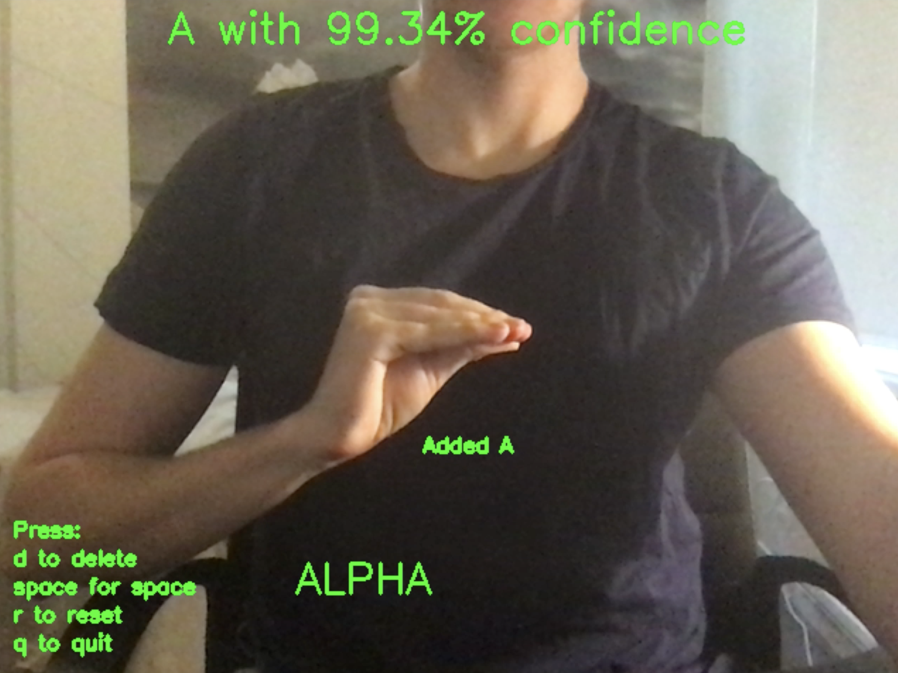
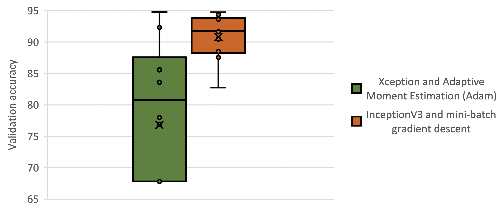
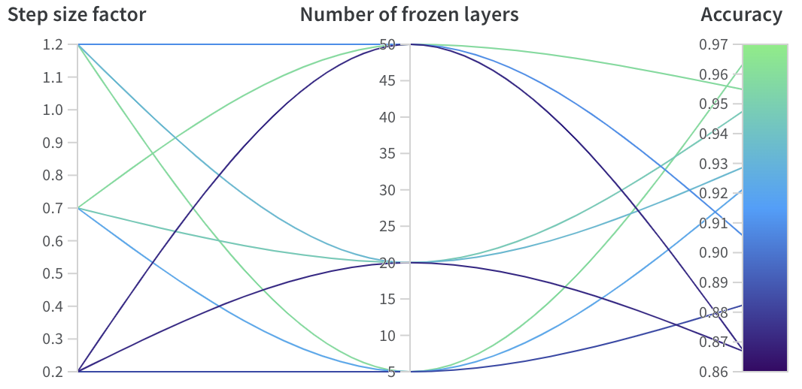
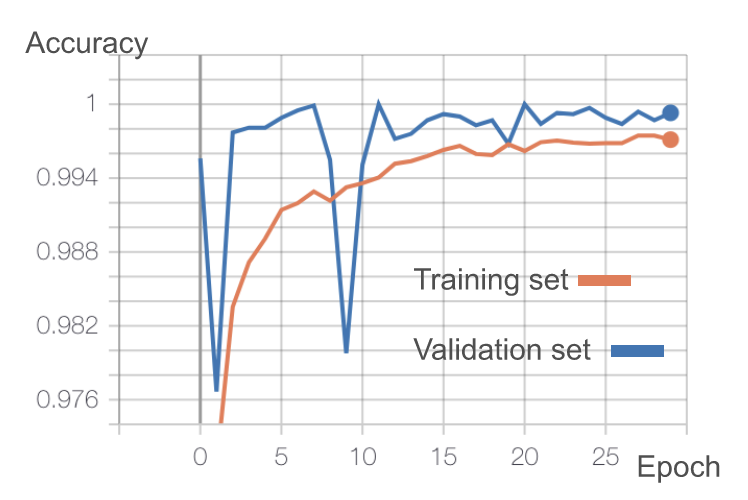
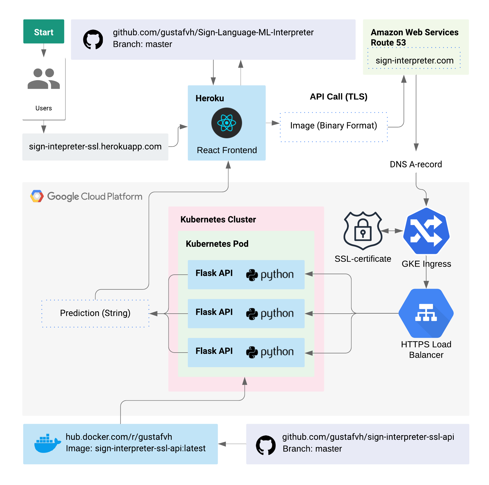

# Sign Interpreter Application for Swedish Sign Language
Deep Neural Network for predicting Swedish Sign Language Signs that utilises CNN and Transfer Learning. Contains code for Model, Data Generator and Frontend Application.

By [Gustaf Halvardsson](https://github.com/gustafvh) & [Johanna Peterson](https://github.com/johannakin) 

(Please observe that the **backend-server may be down periodically** because of budget-constraints as students)


Try the app here: https://sign-interpreter-ssl.herokuapp.com/




Watch demo of final result here (only of model): https://drive.google.com/file/d/1w41VtaLMaOe6w_Z0_XVI1TQEAPPsmwIV/view?usp=sharing 

# Model
The goal of this project was to utlise transfer learning and CNN to identify 26 letters from the Swedish Sign Language Alphabet despite access to limited data. By freezing the first layers of the **[InceptionV3](https://github.com/tensorflow/models/tree/master/research/inception)** base-model we could utlise its ability to detetct low-level features and then retrain the remaing layers using our own data. 

## Technologies used
- **Keras & Tensorflow**. Was selected over PyTorch for its compatability and community support.
- **Google Colab**. Utlised is on-demand GPUs for faster training.
- **Weights & Biases**. Used for helping visualising models performance and which hyperparameters to tune. 
- **OpenCV**. Used for image processing.

## Reaching the Final Network architecture

When choosing the pre-trained models for transfer learning, InceptionV3 and Xception were considered. They were evaluated with two different optimization algorithms, Mini-batch Gradient Descent and Adam. They were tested with both combinations to make sure any potential difference was statistically significant. For that the [Wilcoxon Signed Rank Test](https://en.wikipedia.org/wiki/Wilcoxon_signed-rank_test) was used. This established the InceptionV3 with mini-batch gradient descent as the most performant model. You can see the comparison below. Please note that all accuracy displayed in the graphs is on the validation dataset. 


	
After that the hyperparameters were tuned and the final model used a step-size-factor of 1.2 and freezed five layers of the pre-trained model. 



## Performance & Results

The final **testing accuracy** on the testing datatset was **85%**. 

The final model consisted of **316 layers**, **25.5 million parameters**. 

This is its performance during its training routine. 


	
You can find and use the final model architecture here:
https://app.wandb.ai/sign-interpretor/sign-interpreter/runs/y11of78x/files/model-best.h5

# Frontend

## Technologies used
- Written in **Javascript** using **React**, **HTML** and **CSS**. 
- **Webpack** handles all dependency and builds the final optimized build.
- Deployed via **Heroku** on the domain https://sign-interpreter-ssl.herokuapp.com/ and uses automatic deployment connected to this master-branch.


### Node Packages 
The following node-packages were used
```javascript
    "async": "^3.2.0",
    "axios": "^0.19.2",
    "dotenv": "^8.2.0",
    "firebase": "^7.14.1",
    "node-sass": "^4.13.1",
    "normalize.css": "^8.0.1",
    "react": "^16.13.1",
    "react-dom": "^16.13.1",
    "react-scripts": "3.4.1",
    "react-webcam": "^5.0.1"
```

# Backend
This app uses a seperated backend API in Python that we have also written. The frontend sends a HTTP POST-request to the backend which hosts our trained model (output from our model program) and returns a prediction.
You can view that API repository here: https://github.com/gustafvh/sign-interpreter-ssl-api

## Architecture



Try the app here: https://sign-interpreter-ssl.herokuapp.com/
(Please observe that the backend-server may be down periodically because of budget-constraints as students)

Watch demo of final result here (only of model): https://drive.google.com/file/d/1w41VtaLMaOe6w_Z0_XVI1TQEAPPsmwIV/view?usp=sharing 

## Plans for future work
- Smartphone responsive
- Support user-uploads for training data to improve model-accuracy
